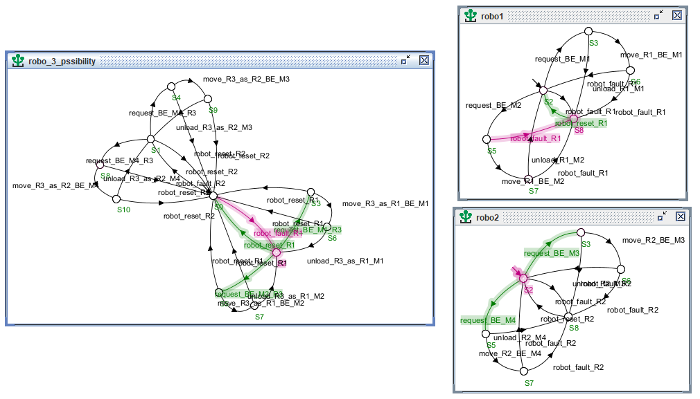
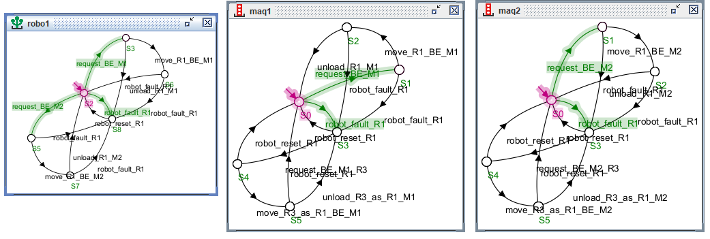
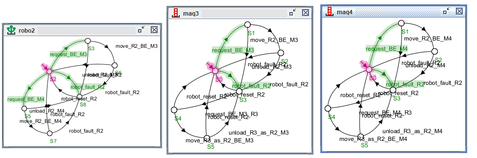
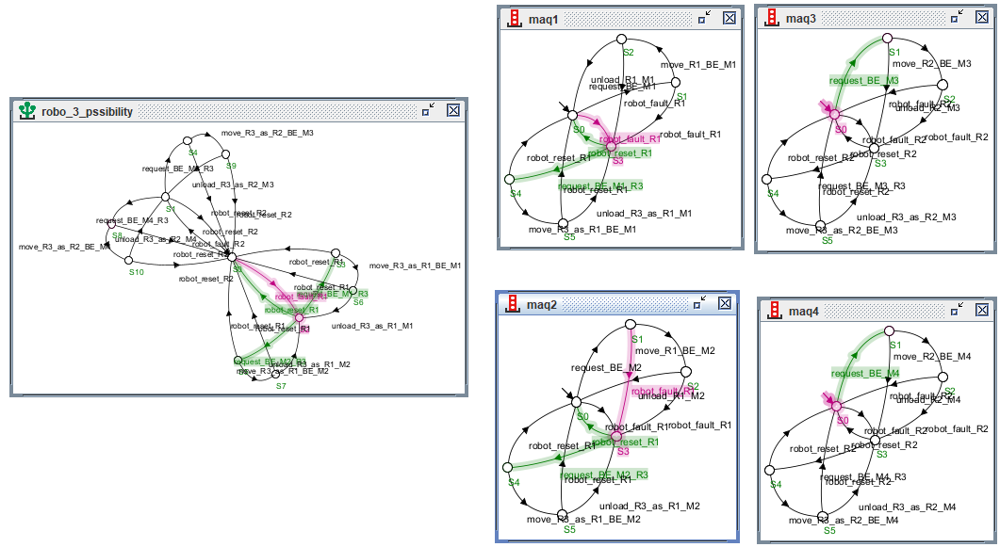
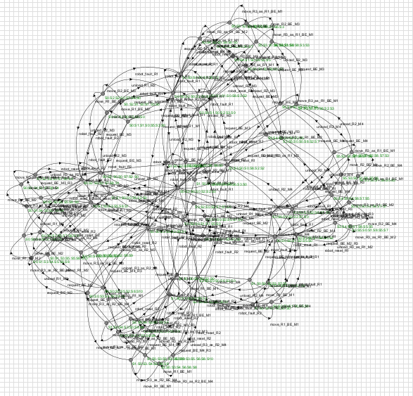
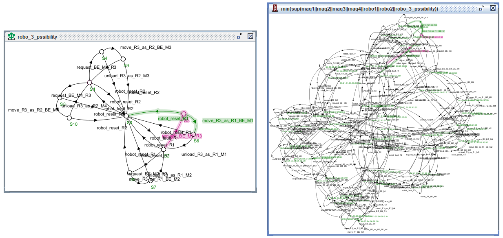

# sed_projet
# Controle de Robôs Autônomos em um Armazém

Este repositório contém a implementação do projeto **Controle de Robôs Autônomos em um Armazém**, desenvolvido como parte da disciplina **Sistemas a Eventos Discretos** na **Universidade Federal de Campina Grande (UFCG)**.

## Integrantes do Projeto
- Gabrielle Pereira Barbosa
- Sarah Stella Borba Miguel
- Victor Gomes de Freitas Borge

## Professor Orientador
- Prof. Kyller Costa Gorgônio

## Descrição
O projeto tem como objetivo desenvolver um sistema de controle supervisionado para robôs móveis em um armazém automatizado. O sistema é baseado em **Autômatos Finitos** e **Controle Supervisório**, garantindo que os robôs realizem suas tarefas sem colisões e seguindo as regras operacionais predefinidas.

### Componentes do Sistema
- **3 Robôs (R1, R2, R3):** Transportam caixas do Buffer de Entrada (BE) para as máquinas de processamento.
- **4 Máquinas (M1, M2, M3, M4):** Recebem os insumos e processam as cargas.
- **Buffer de Entrada (BE):** Local onde os robôs coletam os insumos antes da entrega.

## Funcionamento do Sistema

### **Autômatos de Robôs**
- **R1 e R2**: Ficam em repouso até receberem um `request` de uma máquina. Após isso, fazem o `move` para carregar a caixa do BE até a máquina solicitante. Ao chegar, realizam o `unload` e retornam ao BE.
- **R3 (Robô Reserva)**: Ativado quando há falha em R1 ou R2. Assume o `move` e completa a tarefa pendente.
  

### **Autômatos das Máquinas**
- Cada máquina começa no estado de repouso e pode fazer um `request` por insumos.
- Caso o robô associado falhe, a máquina pode acionar o robô reserva (R3).
- Nas figuras abaixo, podemos ver a interação entre os robôs 1, 2 e 3 e as máquinas.

#### **Robô 1 e Máquinas 1 e 2**

#### **Robô 2 e Máquinas 3 e 4**

#### **Robô 3 e Máquinas 1 e 2 ou Máquinas 3 e 4**

### **Supervisor**
- Coordena as interações entre os autômatos.
- Gerencia os `requests`, `moves`, falhas e ativações do robô reserva.
- Garante que cada robô atenda apenas suas máquinas designadas (R1 → M1 e M2; R2 → M3 e M4).
#### **Supervisório**

## Implementação
A implementação do sistema foi realizada utilizando **autômatos finitos** para modelagem do comportamento dos robôs e das máquinas, além de um **supervisor** para gerenciar as transições de estado e as falhas eventuais. 
#### **Supervisório e Robô 3**

## Requisitos
- Ferramentas para modelagem de autômatos, Supremica foi utilizado nesse caso
- Java | Oracle

## Apresentação do Projeto
Assista à apresentação do projeto no YouTube: [Link para o vídeo]

## Relatório
O relatório completo do projeto está disponível neste repositório como **Relatório_SED.pdf**.

